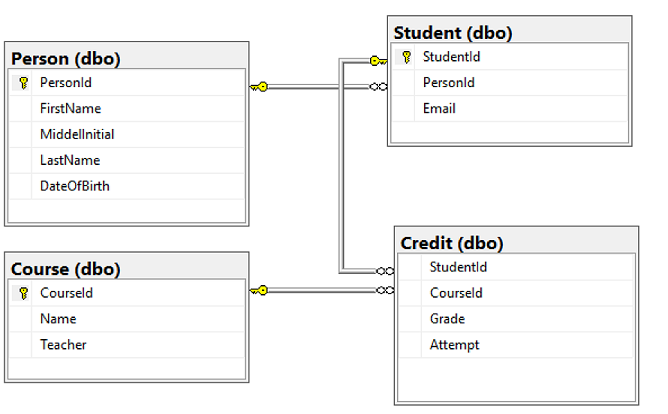

# Student management system for universities

## Schema


## Create tables
```sql
-- Create Person table
CREATE TABLE Person
(
    PersonId INT IDENTITY PRIMARY KEY,
    FirstName NVARCHAR(128) NOT NULL,
    MiddelInitial NVARCHAR(10),
    LastName NVARCHAR(128) NOT NULL,
    DateOfBirth DATE NOT NULL
)

-- Create Student table
CREATE TABLE Student
(
    StudentId INT IDENTITY PRIMARY KEY,
    PersonId INT REFERENCES Person (PersonId),
    Email NVARCHAR(256)
)

-- Create Course table
CREATE TABLE Course
(
    CourseId INT IDENTITY PRIMARY KEY,
    Name NVARCHAR(50) NOT NULL,
    Teacher NVARCHAR(256) NOT NULL
)

-- Create Credit table
CREATE TABLE Credit
(
    StudentId INT REFERENCES Student (StudentId),
    CourseId INT REFERENCES Course (CourseId),
    Grade DECIMAL(5,2) CHECK (Grade <= 100.00),
    Attempt TINYINT,
    PRIMARY KEY ([StudentId], [CourseId], [Grade], [Attempt])
)
```

## Sample Data
### Course
| CourseID | Name                | Teacher         |
| -------- | ------------------- | --------------- |
| 1        | Circuit Analysis    | Kellen Horton   |
| 2        | Calculus            | Kamron Saunders |
| 3        | Introduction to Law | Dominick Pope   |
| 4        | Circuit Analysis    | Gerardo Grimes  |
| ...      | ...                 | ...             |

### Person
| PersonId | FirstName | MiddelInitial | LastName | DateOfBirth |
| -------- | --------- | ------------- | -------- | ----------- |
| 1        | Adele     | S             | Rosales  | 1984-05-05  |
| 2        | Justus    | Z             | Gomez    | 2007-04-06  |
| 3        | Isiah     | Z             | Warner   | 1992-06-04  |
| 4        | Erica     | L             | Campos   | 1994-05-14  |
| ...      | ...       | ...           |...       |...          |

### Student
| StudentID | PersonID | Email                       |
| --------- | -------- | --------------------------- |
| 1         | 1        | AdeleRosales@university.com |
| 2         | 2        | JustusGomez@university.com  |
| 3         | 3        | IsiahWarner@university.com  |
| 4         | 4        | EricaCampos@university.com  |
| ...       | ...      | ...                         |

### Credit
| StudentId | CourseId | Grade | Attempt |
| --------- | -------- | ----- | ------- |
| 3         | 25       | 61.79 | 2       |
| 4         | 9        | 79    | 2       |
| 4         | 21       | 15.97 | 2       |
| 5         | 14       | 22.06 | 2       |
| ...       | ...      | ...   | ...     |
