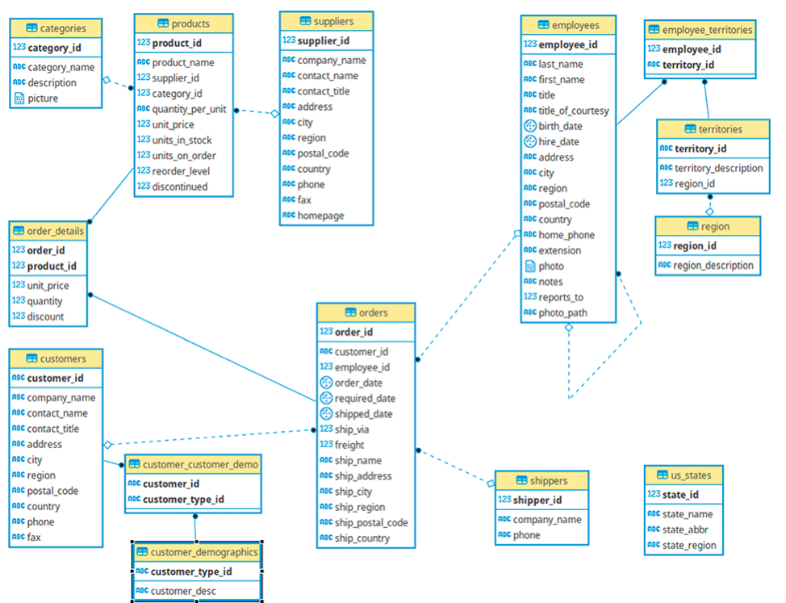

# YugabyteDB - Northwind sample database

## Schema
<picture>
  <source media="(prefers-color-scheme: dark)" srcset="database-schema.dark.png">
  
</picture>


## Create tables
```sql
----------------------------------------------------------------
-- TODO : convert from Postgesql to MySql syntax!
----------------------------------------------------------------

--
-- Name: categories; Type: TABLE; Schema: public; Owner: -; Tablespace: 
--

CREATE TABLE categories (
    `category_id` smallint NOT NULL PRIMARY KEY,
    `category_name` NVARCHAR(15) NOT NULL,
    `description` text,
    `picture` bytea
);


--
-- Name: customer_demographics; Type: TABLE; Schema: public; Owner: -; Tablespace: 
--

CREATE TABLE customer_demographics (
    customer_type_id NVARCHAR(10) NOT NULL PRIMARY KEY,
    customer_desc text
);


--
-- Name: customers; Type: TABLE; Schema: public; Owner: -; Tablespace: 
--

CREATE TABLE customers (
    customer_id NVARCHAR(10) NOT NULL PRIMARY KEY,
    company_name NVARCHAR(40) NOT NULL,
    contact_name NVARCHAR(30),
    contact_title NVARCHAR(30),
    address NVARCHAR(60),
    city NVARCHAR(15),
    region NVARCHAR(15),
    postal_code NVARCHAR(10),
    country NVARCHAR(15),
    phone NVARCHAR(24),
    fax NVARCHAR(24)
);

--
-- Name: customer_customer_demo; Type: TABLE; Schema: public; Owner: -; Tablespace: 
--

CREATE TABLE customer_customer_demo (
    customer_id NVARCHAR(10) NOT NULL,
    customer_type_id NVARCHAR(10) NOT NULL,
    PRIMARY KEY (customer_id, customer_type_id),
    FOREIGN KEY (customer_type_id) REFERENCES customer_demographics,
    FOREIGN KEY (customer_id) REFERENCES customers
);

--
-- Name: employees; Type: TABLE; Schema: public; Owner: -; Tablespace: 
--

CREATE TABLE employees (
    employee_id smallint NOT NULL PRIMARY KEY,
    last_name NVARCHAR(20) NOT NULL,
    first_name NVARCHAR(10) NOT NULL,
    title NVARCHAR(30),
    title_of_courtesy NVARCHAR(25),
    birth_date date,
    hire_date date,
    address NVARCHAR(60),
    city NVARCHAR(15),
    region NVARCHAR(15),
    postal_code NVARCHAR(10),
    country NVARCHAR(15),
    home_phone NVARCHAR(24),
    extension NVARCHAR(4),
    photo bytea,
    notes text,
    reports_to smallint,
    photo_path NVARCHAR(255),
	FOREIGN KEY (reports_to) REFERENCES employees
);


--
-- Name: suppliers; Type: TABLE; Schema: public; Owner: -; Tablespace: 
--

CREATE TABLE suppliers (
    supplier_id smallint NOT NULL PRIMARY KEY,
    company_name NVARCHAR(40) NOT NULL,
    contact_name NVARCHAR(30),
    contact_title NVARCHAR(30),
    address NVARCHAR(60),
    city NVARCHAR(15),
    region NVARCHAR(15),
    postal_code NVARCHAR(10),
    country NVARCHAR(15),
    phone NVARCHAR(24),
    fax NVARCHAR(24),
    homepage text
);


--
-- Name: products; Type: TABLE; Schema: public; Owner: -; Tablespace: 
--

CREATE TABLE products (
    product_id smallint NOT NULL PRIMARY KEY,
    product_name NVARCHAR(40) NOT NULL,
    supplier_id smallint,
    category_id smallint,
    quantity_per_unit NVARCHAR(20),
    unit_price real,
    units_in_stock smallint,
    units_on_order smallint,
    reorder_level smallint,
    discontinued integer NOT NULL,
	FOREIGN KEY (category_id) REFERENCES categories,
	FOREIGN KEY (supplier_id) REFERENCES suppliers
);


--
-- Name: region; Type: TABLE; Schema: public; Owner: -; Tablespace: 
--

CREATE TABLE region (
    region_id smallint NOT NULL PRIMARY KEY,
    region_description NVARCHAR(10) NOT NULL
);


--
-- Name: shippers; Type: TABLE; Schema: public; Owner: -; Tablespace: 
--

CREATE TABLE shippers (
    shipper_id smallint NOT NULL PRIMARY KEY,
    company_name NVARCHAR(40) NOT NULL,
    phone NVARCHAR(24)
);


--
-- Name: orders; Type: TABLE; Schema: public; Owner: -; Tablespace: 
--

CREATE TABLE orders (
    order_id smallint NOT NULL PRIMARY KEY,
    customer_id NVARCHAR(10),
    employee_id smallint,
    order_date date,
    required_date date,
    shipped_date date,
    ship_via smallint,
    freight real,
    ship_name NVARCHAR(40),
    ship_address NVARCHAR(60),
    ship_city NVARCHAR(15),
    ship_region NVARCHAR(15),
    ship_postal_code NVARCHAR(10),
    ship_country NVARCHAR(15),
    FOREIGN KEY (customer_id) REFERENCES customers,
    FOREIGN KEY (employee_id) REFERENCES employees,
    FOREIGN KEY (ship_via) REFERENCES shippers
);


--
-- Name: territories; Type: TABLE; Schema: public; Owner: -; Tablespace: 
--

CREATE TABLE territories (
    territory_id NVARCHAR(20) NOT NULL PRIMARY KEY,
    territory_description NVARCHAR(10) NOT NULL,
    region_id smallint NOT NULL,
	FOREIGN KEY (region_id) REFERENCES region
);


--
-- Name: employee_territories; Type: TABLE; Schema: public; Owner: -; Tablespace: 
--

CREATE TABLE employee_territories (
    employee_id smallint NOT NULL,
    territory_id NVARCHAR(20) NOT NULL,
    PRIMARY KEY (employee_id, territory_id),
    FOREIGN KEY (territory_id) REFERENCES territories,
    FOREIGN KEY (employee_id) REFERENCES employees
);


--
-- Name: order_details; Type: TABLE; Schema: public; Owner: -; Tablespace: 
--

CREATE TABLE order_details (
    order_id smallint NOT NULL,
    product_id smallint NOT NULL,
    unit_price real NOT NULL,
    quantity smallint NOT NULL,
    discount real NOT NULL,
    PRIMARY KEY (order_id, product_id),
    FOREIGN KEY (product_id) REFERENCES products,
    FOREIGN KEY (order_id) REFERENCES orders
);


--
-- Name: us_states; Type: TABLE; Schema: public; Owner: -; Tablespace: 
--

CREATE TABLE us_states (
    state_id smallint NOT NULL PRIMARY KEY,
    state_name NVARCHAR(100),
    state_abbr NVARCHAR(2),
    state_region NVARCHAR(50)
);
```

## Sample Data
### categories
| category_id | category_name  | description                                                | picture |
| ----------- | -------------- | ---------------------------------------------------------- | ------- |
| 1           | Beverages      | Soft drinks, coffees, teas, beers, and ales                | null    |
| 2           | Condiments     | Sweet and savory sauces, relishes, spreads, and seasonings | null    |
| 3           | Confections    | Desserts, candies, and sweet breads                        | null    |
| 4           | Dairy Products | Cheeses                                                    | null    |
| ...         | ...            | ...                                                        | ...     |

### TODO: data examples for other tables ...
